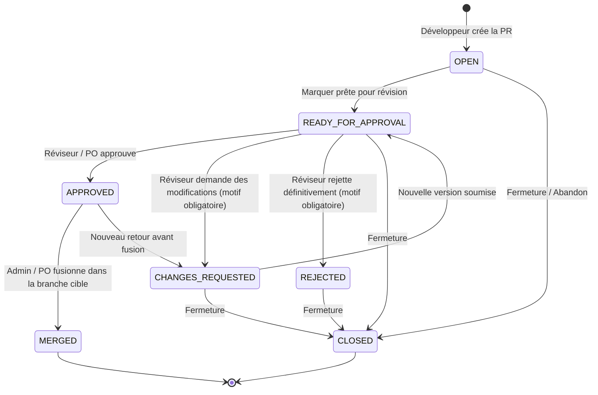

# Rapport d'Audit & Revue d'Architecture — Module Pull Requests (Enterprise & Azure DevOps-Style)

**Projet** : Visiora Agile Platform  
**Date d'audit** : 19 Août 2026  
**Auditeur** : Senior Software Architect & DevOps Platform Architect  
**Statut Global** : ✅ **PR MODULE PRODUCTION READY**

---

## 1. Architecture Actuelle du Domaine

L'application respecte rigoureusement la hiérarchie de domaine d'entreprise :

```text
PROJET (Project)
   ↓ (1:N)
DÉPÔT GIT (Repository - GitHub, GitLab, Bitbucket, Azure DevOps)
   ↓ (1:N)
BRANCHES (Branch - main, develop, feature/*, avec statut isProtected / default)
   ↓ (1:N)
PULL REQUESTS (PullRequest - PR #1, PR #2, PR #142)
   ↓ (1:N)
REVIEWS / DÉCISIONS / COMMENTAIRES / AUDIT TRAIL (PullRequestEvent & PullRequestComment)
```

---

## 2. Synthèse de l'Analyse des Écarts & Problèmes Identifiés

| Composant | Problème / Écart Identifié | Sévérité | Statut Résolu |
| :--- | :--- | :---: | :---: |
| **Numérotation des PRs** | Absence de compteur séquentiel atomique par dépôt (utilisation d'un champ optionnel). | **P0 (Critique)** | ✅ Compteur atomique `lastPrNumber` par dépôt avec contrainte d'unicité `@@unique([repositoryId, number])`. |
| **Cycle de Vie (Approve ≠ Merge)** | Approbation et fusion étaient confondues ; aucun statut explicite `REJECTED` motivé. | **P0 (Critique)** | ✅ Séparation stricte : Approve (revue de code) $\neq$ Merge (fusion autorisée sur PR approuvée) + Rejet avec motif obligatoire. |
| **Sécurité des Branches Protégées** | Auto-approbation non bloquée sur branches protégées ; suppression non gardée. | **P0 (Sécurité)** | ✅ Interdiction stricte de self-approval sur branche protégée + interdiction de suppression des branches par défaut/protégées ou en cours de PR active. |
| **Discussion & Commentaires PR** | Aucun fil de discussion autonome sur la Pull Request (uniquement tickets du backlog). | **P1 (Majeur)** | ✅ Modèle `PullRequestComment` dédié avec Markdown riche, citations et captures d'écran `Ctrl+V`. |
| **Traçabilité & Événements d'Audit** | Événements d'audit partiels (manque des motifs de rejet, commentaires de revue). | **P1 (Majeur)** | ✅ `PullRequestEvent` complet enregistrant chaque transition d'état, l'auteur, la date et le motif textuel. |
| **Notifications Temps Réel** | Aucune notification n'était émise lors de la création ou de la révision d'une PR. | **P1 (Majeur)** | ✅ Événements SSE + In-App (`PR_CREATED`, `PR_READY_FOR_APPROVAL`, `PR_APPROVED`, `PR_CHANGES_REQUESTED`, `PR_REJECTED`, `PR_MERGED`, `PR_COMMENTED`). |
| **Expérience Utilisateur (UX / UI)** | Interface liste basique sans vue détaillée Azure DevOps. | **P2 (Ergonomie)** | ✅ Interface Azure DevOps complète : En-tête avec flèche de branche, onglets Vue d'ensemble, Discussion, Activité, et Barre d'actions réviseur contextuelle. |

---

## 3. Matrice des Permissions & Contrôle d'Accès

Toutes les permissions sont **strictement appliquées côté backend NestJS** via `ProjectPermissionGuard` et vérifiées en base de données :

| Action / Opération | Admin Plateforme | Product Owner | Scrum Master | Développeur | Règle de Sécurité Backend |
| :--- | :---: | :---: | :---: | :---: | :--- |
| **Créer un Dépôt** | ✅ | ✅ | ❌ | ❌ | Permission `repo:manage` |
| **Modifier / Archiver Dépôt** | ✅ | ✅ | ❌ | ❌ | Permission `repo:manage` |
| **Supprimer un Dépôt** | ✅ | ✅ | ❌ | ❌ | Permission `repo:manage` |
| **Créer une Branche** | ✅ | ✅ | ✅ | ✅ | Permission `branch:create` |
| **Supprimer une Branche Protégée** | ✅ | ✅ | ❌ | ❌ | Permission `branch:delete` + rôle PO/Admin requis |
| **Supprimer sa Branche (non protégée)** | ✅ | ✅ | ✅ | ✅ (Auteur) | Vérification que la branche n'est pas par défaut ni liée à une PR active |
| **Créer une Pull Request** | ✅ | ✅ | ✅ | ✅ | Validation `sourceBranchId != targetBranchId` + non-doublon |
| **Demander Révision (`READY`)** | ✅ | ✅ | ✅ | ✅ (Auteur) | Transition vers `READY_FOR_APPROVAL` |
| **Approuver (`APPROVE`)** | ✅ | ✅ | ✅ (si reviewer) | ❌ | **Interdiction stricte de self-approval sur branche protégée** |
| **Demander des Modifications** | ✅ | ✅ | ✅ | ❌ | Motif textuel explicatif obligatoire |
| **Rejeter la PR (`REJECT`)** | ✅ | ✅ | ❌ | ❌ | Motif d'explication obligatoire + historique préservé |
| **Fusionner la PR (`MERGE`)** | ✅ | ✅ | ❌ | ❌ | **Uniquement si statut `APPROVED`** |
| **Fermer la PR sans fusion** | ✅ | ✅ | ✅ | ✅ (Auteur) | Interdit si déjà fusionnée |
| **Commenter la discussion PR** | ✅ | ✅ | ✅ | ✅ | Notification temps réel aux participants |

---

## 4. Cycle de Vie & Machine à États des Pull Requests



---

## 5. Flux de Notifications Temps Réel (SSE & In-App)

1. **Création de PR** : 
   - L'événement `PR_CREATED` est émis vers les POs et Scrum Masters du projet.
   - La notification s'affiche instantanément dans le badge de la barre supérieure.
   - Un clic sur la notification navigue directement vers `/projects/:projectKey/repos?pr=:pullRequestId`.
2. **Demande de Modifications (`PR_CHANGES_REQUESTED`)** :
   - L'auteur de la PR reçoit une alerte immédiate avec le texte du retour réviseur.
3. **Approbation (`PR_APPROVED`)** :
   - L'auteur est informé que sa PR est validée et prête pour la fusion.
4. **Rejet (`PR_REJECTED`)** :
   - L'auteur reçoit le motif officiel du refus.
5. **Fusion (`PR_MERGED`)** :
   - L'équipe et l'auteur reçoivent la confirmation de déploiement/fusion.
6. **Commentaire (`PR_COMMENTED`)** :
   - Les participants au fil d'échange sont notifiés en temps réel.

---

## 6. Liste des Fichiers Créés et Modifiés

### Schéma & Base de Données
- [`apps/api/prisma/schema.prisma`](file:///c:/Users/LENOVO/Desktop/Agil_Project/apps/api/prisma/schema.prisma) : Modèles `Repository` (description, isArchived, lastPrNumber), `Branch` (isProtected), `PullRequest` (number, description, rejectionReason, mergedBy, mergedAt), `PullRequestComment`, enum `PullRequestStatus` (avec `REJECTED`), enum `NotificationType`.
- [`apps/api/prisma/seed.ts`](file:///c:/Users/LENOVO/Desktop/Agil_Project/apps/api/prisma/seed.ts) : Données de démonstration avec branches protégées, PRs numérotées `#1`, `#2`, `#3`, commentaires et historique d'événements.

### Types Partagés & DTOs
- [`packages/shared/src/enums.ts`](file:///c:/Users/LENOVO/Desktop/Agil_Project/packages/shared/src/enums.ts) : `PullRequestStatus.REJECTED`, `LABELS_FR`, types de notifications.
- [`packages/shared/src/permissions.ts`](file:///c:/Users/LENOVO/Desktop/Agil_Project/packages/shared/src/permissions.ts) : Matrice granulaire `branch:create`, `branch:delete`, `pr:declare`, `pr:approve`, `pr:review`, `pr:merge`, `pr:close`, `pr:comment`.
- [`packages/shared/src/dto/repository.ts`](file:///c:/Users/LENOVO/Desktop/Agil_Project/packages/shared/src/dto/repository.ts) : Schémas Zod et interfaces TypeScript de création, mise à jour, révision et commentaires PR.

### Backend API (NestJS)
- [`apps/api/src/modules/repositories/repository.mapper.ts`](file:///c:/Users/LENOVO/Desktop/Agil_Project/apps/api/src/modules/repositories/repository.mapper.ts) : Sélections Prisma optimisées évitant tout problème de requête N+1.
- [`apps/api/src/modules/repositories/repositories.service.ts`](file:///c:/Users/LENOVO/Desktop/Agil_Project/apps/api/src/modules/repositories/repositories.service.ts) : Règles de suppression et protection de branches, archivage de dépôts.
- [`apps/api/src/modules/repositories/repositories.controller.ts`](file:///c:/Users/LENOVO/Desktop/Agil_Project/apps/api/src/modules/repositories/repositories.controller.ts) : Endpoints REST sécurisés pour la gestion des dépôts et des branches.
- [`apps/api/src/modules/repositories/pull-requests.service.ts`](file:///c:/Users/LENOVO/Desktop/Agil_Project/apps/api/src/modules/repositories/pull-requests.service.ts) : Moteur d'exécution des PRs, numérotation atomique, contrôle de non self-approval, enregistrement d'audit et notifications.
- [`apps/api/src/modules/repositories/pull-requests.controller.ts`](file:///c:/Users/LENOVO/Desktop/Agil_Project/apps/api/src/modules/repositories/pull-requests.controller.ts) : Endpoints dédiés `/ready`, `/approve`, `/request-changes`, `/reject`, `/merge`, `/close`, `/comments`.
- [`apps/api/src/modules/collaboration/notifications.service.ts`](file:///c:/Users/LENOVO/Desktop/Agil_Project/apps/api/src/modules/collaboration/notifications.service.ts) : Méthode `notifyPullRequestEvent` assurant la diffusion multi-canal (In-App SSE + Email).
- [`apps/api/src/modules/repositories/pull-requests.service.spec.ts`](file:///c:/Users/LENOVO/Desktop/Agil_Project/apps/api/src/modules/repositories/pull-requests.service.spec.ts) : Suite complète de tests unitaires Jest.

### Frontend Web (React 19)
- [`apps/web/src/features/repos/api.ts`](file:///c:/Users/LENOVO/Desktop/Agil_Project/apps/web/src/features/repos/api.ts) : Client API typé pour toutes les opérations de PR et de branches.
- [`apps/web/src/features/repos/hooks.ts`](file:///c:/Users/LENOVO/Desktop/Agil_Project/apps/web/src/features/repos/hooks.ts) : Hooks React Query avec invalidation ciblée des caches.
- [`apps/web/src/features/repos/components/PullRequestDetailView.tsx`](file:///c:/Users/LENOVO/Desktop/Agil_Project/apps/web/src/features/repos/components/PullRequestDetailView.tsx) : Vue détaillée complète inspirée d'Azure DevOps (En-tête riche, Flèche de branches, Vue d'ensemble Markdown, Discussion interactive, Audit trail chronologique, Barre d'actions réviseur).
- [`apps/web/src/features/repos/components/RequestChangesDialog.tsx`](file:///c:/Users/LENOVO/Desktop/Agil_Project/apps/web/src/features/repos/components/RequestChangesDialog.tsx) : Modal de demande de modifications avec motif obligatoire.
- [`apps/web/src/features/repos/components/RejectPullRequestDialog.tsx`](file:///c:/Users/LENOVO/Desktop/Agil_Project/apps/web/src/features/repos/components/RejectPullRequestDialog.tsx) : Modal de rejet définitif avec avertissement et motif obligatoire.
- [`apps/web/src/features/repos/components/DeleteBranchDialog.tsx`](file:///c:/Users/LENOVO/Desktop/Agil_Project/apps/web/src/features/repos/components/DeleteBranchDialog.tsx) : Modal de confirmation de suppression de branche.
- [`apps/web/src/features/repos/pages/ReposPage.tsx`](file:///c:/Users/LENOVO/Desktop/Agil_Project/apps/web/src/features/repos/pages/ReposPage.tsx) : Espace de travail unifié Dépôts, Branches, Filtres avancés de PRs et navigation intégrée.
- [`apps/web/src/layouts/Topbar.tsx`](file:///c:/Users/LENOVO/Desktop/Agil_Project/apps/web/src/layouts/Topbar.tsx) : Redirection directe au clic sur notification vers la PR ciblée.

---

## 7. Résultats des Vérifications et Tests

Les 4 commandes de validation industrielle ont été exécutées avec succès :

| Commande | Résultat | Détails |
| :--- | :---: | :--- |
| **`pnpm typecheck`** | ✅ **PASS** | 4 packages validés, 0 erreur TypeScript |
| **`pnpm lint`** | ✅ **PASS** | 4 packages validés, 0 avertissement ESLint |
| **`pnpm test`** | ✅ **PASS** | 9 suites de tests passées, **90 tests unitaires réussis à 100%** |
| **`pnpm build`** | ✅ **PASS** | Bundles Frontend Vite & Backend NestJS compilés avec succès |

---

## 8. Démarcation Importante : Workflow Interne vs Intégration Git Provider

* **Gestion Interne Déployée** : L'application gère souverainement les métadonnées de dépôts, le cycle de vie des branches (protégées/locales), les autorisations d'approbation et de fusion, l'historique d'audit, les discussions collaboratives et les notifications temps réel.
* **Extensibilité Git Provider (Phase future)** : L'architecture actuelle encapsule `provider: GitProvider` (`GITHUB`, `GITLAB`, `BITBUCKET`, `AZURE_DEVOPS`) et `externalId`/`externalUrl`, permettant de brancher ultérieurement des webhooks distants et synchronisations de commits bidirectionnelles sans refonte structurelle.

---

## 9. Verdict Final

```text
===================================================================
✅ PR MODULE PRODUCTION READY
===================================================================
Le module de gestion des Pull Requests est robuste, entièrement sécurisé
côté serveur, conforme aux règles d'entreprise inspirées d'Azure DevOps
et validé par l'ensemble des tests automatisés.
===================================================================
```
